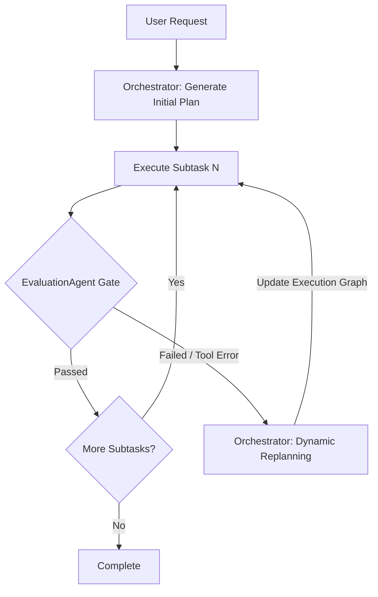
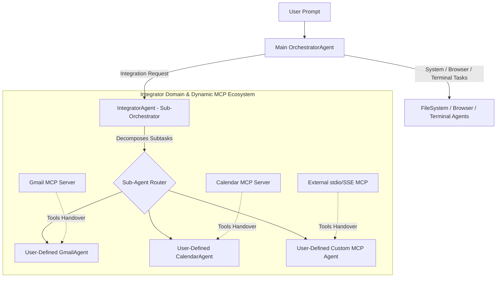
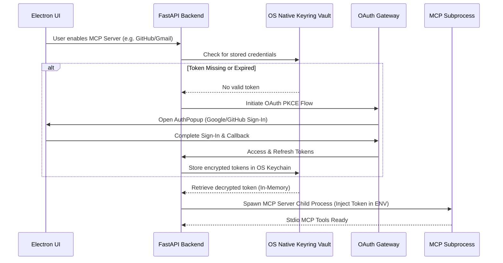

# OpenAgents: Final Year Project Enhancement Strategy & Roadmap

## 1. Academic & Technical Vision
OpenAgents is a multi-agent desktop application engineered to automate multi-step system and web tasks via heterogeneous Large Language Model (LLM) orchestration. To transition this project from a functional prototype into a top-tier **Final Year Computer Science / Software Engineering Capstone Project**, the system requires enhanced **academic rigor, self-healing execution loops, system sandboxing, contextual long-term memory, and empirical evaluation metrics**.

---

## 2. Baseline Architecture vs. Enhanced Target State

```
                       Current State                        Enhanced Target State
 ┌────────────────────────────────────────────────────────┐ ┌────────────────────────────────────────────────────────┐
 │ • Linear, pre-planned subtask sequence                 │ │ • Dynamic replanning & state-aware execution graphs    │
 │ • Basic string-matching prompt guardrails              │ │ • Interactive Human-in-the-Loop (HITL) & Sandboxing    │
 │ • Context reset per request (No long-term memory)      │ │ • Episodic memory (Vector DB + Workspace RAG store)    │
 │ • Manual inspection (No automated metrics/tests)       │ │ • Empirical evaluation benchmark suite (TCR, Cost, Ops)│
 │ • Basic streaming message UI                           │ │ • Live DAG execution canvas & cost/token analytics UI  │
 └────────────────────────────────────────────────────────┘ └────────────────────────────────────────────────────────┘
```

---

## 3. Prioritized Feature Specifications

### 🟢 Priority 0: Critical Core Architecture & Academic Validation

#### Feature 0.1: Empirical Benchmarking & Evaluation Suite
* **Objective:** Provide quantitative proof of system performance, cost efficiency, and accuracy across different LLM providers and agent configurations for final-year defense.
* **Key Components:**
  * **Deterministic Task Suite:** A benchmark dataset of 30+ standardized tasks spanning File Operations, Research Synthesis, Terminal Command Sequences, and Web Interactions.
  * **Metric Collectors:**
    * **Task Completion Rate (TCR):** Binary and partial credit scoring.
    * **Subtask Precision:** Percentage of subtasks completed without requiring evaluation retries.
    * **Resource Efficiency:** Total prompt tokens, completion tokens, latency (seconds), and API cost ($).
  * **Baseline Comparison Runner:** Automated script comparing:
    1. Single LLM Baseline (e.g. GPT-4o alone).
    2. Static Multi-Agent (Current OpenAgents).
    3. Self-Healing Multi-Agent (Enhanced OpenAgents).
* **Target File Artifacts:**
  * `backend/evals/benchmark_dataset.json`
  * `backend/evals/eval_runner.py`
  * `backend/evals/metrics.py`

#### Feature 0.2: Self-Healing Dynamic Replanning Engine
* **Objective:** Move from static, linear task execution to an adaptive State Graph where subtask failures trigger real-time plan re-evaluations.
* **Key Components:**
  * **Feedback-Driven State Loop:** When `EvaluationAgent` flags an invalid output or a tool returns an error, the failure log is piped back into `OrchestratorAgent`.
  * **Graph Edges (LangGraph):** Replace flat loop in `agent_flow.py` with dynamic nodes (`decompose`, `execute_step`, `evaluate_step`, `replan`).
  * **Plan Mutation:** Ability for Orchestrator to dynamically insert corrective subtasks, skip redundant steps, or change targeted agents mid-execution.
* **Architecture Diagram:**



---

### 🟡 Priority 1: Security, Safety & Contextual Intelligence

#### Feature 1.1: Human-in-the-Loop (HITL) Security Sandboxing
* **Objective:** Enforce zero-trust execution policy for high-risk OS operations (e.g. command execution, bulk file deletion, email dispatching).
* **Key Components:**
  * **Action Risk Classifier:** Categorizes agent actions into `LOW`, `MEDIUM`, and `HIGH` risk levels.
  * **Interactive Approval Gateway:** Intercepts `HIGH` risk tasks at the WebSocket level and sends a pause payload to the Electron renderer.
  * **Approval UI Modal:** Displays proposed command/action, target paths, potential side effects, and buttons for `Approve`, `Deny`, or `Simulate (Dry-Run)`.
* **Target File Artifacts:**
  * `backend/services/security_guard.py`
  * `frontend/src/renderer/components/HITLApprovalModal.tsx`

#### Feature 1.2: Episodic Memory & Local Workspace RAG
* **Objective:** Allow agents to recall user preferences, historical task solutions, and workspace code context across app restarts.
* **Key Components:**
  * **Local Vector DB:** Integrate ChromaDB / LanceDB stored in user application data.
  * **Episodic Store:** Index previous execution plans, successful agent strategies, and user corrections.
  * **Workspace Indexer:** Auto-index local codebase/files so agents can perform semantic search when synthesizing answers or modifying files.
* **Target File Artifacts:**
  * `backend/services/memory_service.py`
  * `backend/agents/rag_agent.py`

---

### 🔵 Priority 2: Extensibility & Advanced UX/Observability

#### Feature 2.1: Full Model Context Protocol (MCP) Client & Server Support
* **Objective:** Enable modular plugin architecture using Anthropic's open Model Context Protocol.
* **Key Components:**
  * Expand `backend/services/mcps.py` to support `stdio` and `SSE` transport layers.
  * Allow users to register dynamic external MCP tool servers (Postgres, GitHub, Docker, Figma) via frontend settings without backend code modifications.

#### Feature 2.2: Visual DAG Execution Canvas & Cost Analytics UI
* **Objective:** Provide a visually stunning interactive execution inspector for live presentations and debugging.
* **Key Components:**
  * **React Flow DAG Canvas:** Live visual rendering of the multi-agent graph, node execution status, and active tool calls.
  * **Token & Cost Analytics Panel:** Real-time chart displaying token consumption breakdown per agent and cost estimations per session.

#### Feature 2.3: Hierarchical Integrator Sub-Orchestrator & User-Defined MCP Agents
* **Objective:** Transform `IntegratorAgent` into a nested **Sub-Orchestrator** capable of managing user-created sub-age⁄nts, splitting complex integration goals across them, and dynamically assigning tools via Model Context Protocol (MCP).
* **Architecture & Workflow:**
  * **Global Request Propagation:** Main `OrchestratorAgent` routes complex external integration prompts (e.g., *"Sync invoice emails with Google Calendar and file a GitHub issue"*) directly to `IntegratorAgent`.
  * **Sub-Task Decomposition:** `IntegratorAgent` acts as a specialized sub-orchestrator, analyzing the integration goal and decomposing it into micro-tasks routed across specialized integration sub-agents.
  * **User-Defined Agent Builder UI:** A frontend interface enabling users to create custom agents on demand (e.g. `NotionAgent`, `SlackAgent`, `PostgresAgent`), defining their persona, LLM provider, and assigned MCP servers.
  * **Dynamic MCP Tool Handover:** `IntegratorAgent` utilizes `MultiServerMCPClient` to query available MCP servers, fetch tool schemas, and bind target tools to user-created sub-agents at execution time.
* **Hierarchical Architecture Diagram:**



* **Target File Artifacts:**
  * `backend/agents/integrator_agent.py` (Refactored to a LangGraph Sub-Orchestrator)
  * `backend/services/mcps.py` (MCP Tool Registry & Dynamic Handover Engine)
  * `backend/routers/agent_config.py` (CRUD routes for user-defined custom agents)
  * `frontend/src/renderer/components/CustomAgentBuilder.tsx` (UI for creating agents & binding MCP servers)

#### Feature 2.4: Automated MCP Package Lifecycle, Interactive OAuth Gateway & OS Vault Encryption
* **Objective:** Solve the open-source MCP onboarding challenge by providing zero-friction background package installation, guided OAuth 2.0 authentication windows, and hardware-encrypted token storage.
* **Key Mechanisms:**
  1. **Automated Package Lifecycle Manager:**
     * OpenAgents maintains an isolated sandbox directory (`~/.openagents/mcp_servers/`).
     * Automatically executes `npx -y <mcp-package>` or `npm install` in background processes when users select an open-source MCP server (e.g. `@modelcontextprotocol/server-github` or custom git repos).
     * Supervises `stdio` daemon child processes, monitoring health and automatically restarting crashed server nodes.
  2. **Interactive OAuth 2.0 PKCE Authorization Gateway:**
     * Intercepts OAuth sign-in requirements from MCP servers.
     * Launches a dedicated Electron popup window (`AuthPopup.tsx`) or deep-link redirect (`openagents://oauth-callback`).
     * Handles code exchange and token refresh handshakes seamlessly in the background.
  3. **OS Native Keyring Encryption (Zero Plain-Text Secrets):**
     * Eliminates plain-text storage of API keys, access tokens, and OAuth secrets in `token.json` or `mcp_config.json`.
     * Leverages **OS Native Credential Vaults** (macOS Keychain Access, Windows Credential Manager, Linux Secret Service API) via Python `keyring` / Electron `safeStorage`.
     * Decrypts tokens in-memory only when starting an MCP child process and injects them securely into the subprocess environment variables (`env`).

* **OAuth & Secure Process Spawning Flow:**



* **Target File Artifacts:**
  * `backend/services/mcp_installer.py` (Subprocess installer & lifecycle manager)
  * `backend/services/vault_service.py` (OS Keyring / safeStorage wrapper)
  * `backend/routers/auth.py` & `backend/services/auth_service.py` (OAuth PKCE Gateway)
  * `frontend/src/renderer/components/AuthPopup.tsx` (Electron Auth Popup)

---

## 4. Implementation Roadmap & Timeline

| Phase | Milestone | Expected Deliverable |
| :--- | :--- | :--- |
| **Phase 1 (Week 1–2)** | Evaluation & Self-Healing Core | `eval_runner.py` benchmark suite & LangGraph dynamic replanner |
| **Phase 2 (Week 3)** | Security & HITL Gateway | Risk classification guardrail & Frontend approval modal |
| **Phase 3 (Week 4)** | Episodic Memory & Workspace RAG | ChromaDB integration & semantic context retriever |
| **Phase 4 (Week 5)** | Hierarchical Integrator & Extensibility | Sub-Orchestrator `IntegratorAgent`, Custom MCP Agent UI & React Flow canvas |
| **Phase 5 (Week 6)** | Defense Preparation & Final Polish | Empirical benchmarking paper plots, visual thesis demo & defense slides |

---

## 5. Proposed Final Year Project Thesis Title Options
1. *"OpenAgents: An Autonomous Multi-Agent Desktop Ecosystem with Dynamic Replanning, Human-in-the-Loop Security, and Heterogeneous LLM Routing"*
2. *"Empirical Benchmarking and Failure-Recovery in Multi-Agent Task Orchestration for Desktop Automation"*
