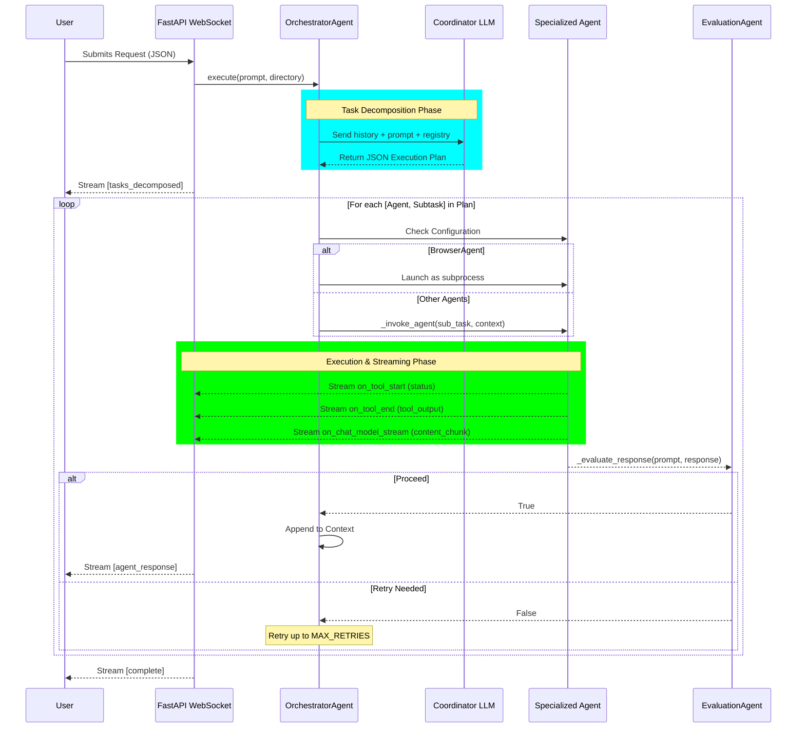
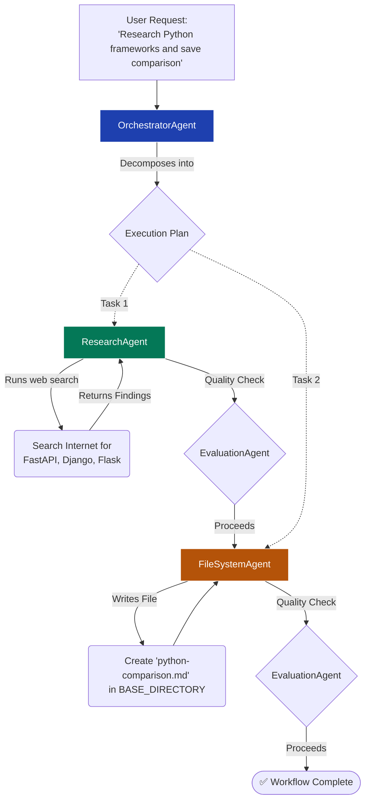

# OpenAgents: A Comprehensive Multi-Agent Desktop Application

## 1. Aim of the Project
OpenAgents is a powerful native desktop application that leverages a multi-agent AI system to automate complex tasks across your system and the web. Its primary goal is to take a generalized user prompt, intelligently decompose it into actionable, sequential subtasks, and route each subtask to highly specialized AI agents. This allows for seamless execution of multifaceted workflows—from browsing the web and gathering research to managing local file systems and executing terminal commands—all while ensuring security, reliability, and real-time feedback.

## 2. Tech Stack Used
The project is built on a modern, high-performance stack separated into a reactive frontend and a robust Python backend.

**Frontend:**
- **Core:** React 19, TypeScript, Vite 6
- **Desktop Framework:** Electron 35 (Windows and macOS support)
- **UI & Styling:** TailwindCSS, Radix UI (accessible primitives), Framer Motion (smooth animations)
- **State Management:** Zustand

**Backend:**
- **Server:** FastAPI, Uvicorn, WebSockets (for real-time streaming to the frontend)
- **Database & Data Validation:** SQLAlchemy, Pydantic
- **AI & Orchestration:** Langchain
- **Automation Tools:** Browser-use, Playwright
- **Model Support:** Support for various LLM providers including Anthropic, OpenAI, Google GenAI, Groq, and local models via Ollama.

## 3. Description

### Agents Involved
The system relies on a collaborative network of specialized agents, each designed for distinct tasks:
- **OrchestratorAgent (Coordinator):** Analyzes user requests, decomposes them into specific subtasks, and routes them to the best-suited agents.
- **BrowserAgent:** Automates web interactions, navigates pages, clicks elements, and extracts structured data.
- **TerminalAgent:** Executes system commands via PowerShell or CMD.
- **FileSystemAgent:** Manages local files and directories (reading, writing, copying, moving).
- **ResearchAgent:** Gathers information from the web, synthesizes facts, and cites sources.
- **IntegratorAgent:** Handles integrations with external services like Email, Google Drive, Calendar, and YouTube.
- **EvaluationAgent:** Acts as an evaluator that verifies agent responses and determines whether to proceed or retry.

### Sample Agent Code
Agents are dynamically created using Langchain. Below is a simplified sample from the **TerminalAgent**, showcasing tool binding and initialization:

```python
from langchain.agents import create_agent
from langchain.tools import tool
import subprocess

@tool
def run_windows_command(commands: list):
    """Executes Windows shell commands and returns output."""
    results = []
    for cmd in commands:
        try:
            completed = subprocess.run(cmd, shell=True, capture_output=True, text=True)
            results.append(completed.stdout + completed.stderr)
        except Exception as e:
            results.append(str(e))
    return "\n".join(results)

def get_agent():
    model = get_agent_llm('TerminalAgent')
    structured_system_prompt = get_structured_prompt(model, TERMINAL_PROMPT)
    
    return create_agent(
        model,
        [run_windows_command, read_file],
        system_prompt=structured_system_prompt,
        name="TerminalAgent"
    )
```

### Tools for Each Agent
- **FileSystemAgent:** `list_directory`, `read_file`, `create_bulk`, `move_bulk`, `rename_bulk`, `delete_bulk`, `search_files`, `write_file`.
- **TerminalAgent:** `run_windows_command`, `read_file`.
- **BrowserAgent:** Navigation, clicking, input, scrolling, wait, screenshot, and LLM-driven data extraction.
- **ResearchAgent:** Web search and summarization tools.
- **IntegratorAgent:** Tools for Gmail, Calendar management, and YouTube search.

### Agent Registries
The system uses a declarative `agent_registry.json` file to manage agent metadata. This registry defines each agent's description, capabilities, and implementation status. The **OrchestratorAgent** dynamically loads this registry, filtering for properly configured models, and constructs its system prompt to accurately route user subtasks based on live agent capabilities.

### System Prompts
System prompts establish strict rules and safety guardrails:
- **Orchestrator:** Instructed to decompose tasks sequentially, replace generic paths with absolute directories, output strict JSON arrays of subtasks, and avoid destructive assignments to unsafe agents.
- **FileSystem:** Instructed to default to UTF-8, use absolute paths, return structured success/error messages, and handle bulk operations gracefully without hallucinating content.
- **Terminal:** Strictly forbidden from running deletion commands (like `rm` or `del`). Must return execution `exit code`, `stdout`, and `stderr` exactly as formatted code blocks.
- **Research:** Must maintain objectivity, prioritize reputable sources, and explicitly cite titles and URLs.

## 4. Detailed Workflow

The architecture uses WebSockets to stream granular progress (token chunks, tool events, errors) directly to the Electron frontend. The Orchestrator plans the process, and an EvaluationAgent acts as a quality gate between steps.



### Visualizing a Task Example

To better understand the flow, here is a visual breakdown of a concrete example where a user asks to **"Research Python frameworks and save comparison"**. 

The Orchestrator splits this ambiguous request into two distinct subtasks routed to different agents:



## 5. System Highlights

A major differentiator of OpenAgents is its highly configurable architecture designed for power users and developers:
- **Custom LLM Providers & APIs:** The system is not locked into a single AI provider. Through the Settings interface, users can plug in their own API keys and choose different models for *each specific agent*. For example, you can route the Orchestrator to OpenAI's GPT-4o for complex planning, while having the FileSystemAgent use a local Ollama model or Anthropic's Claude. Supported providers include Anthropic, OpenAI, Google GenAI, Groq, and Ollama.
- **System Prompt Editing:** Users have full transparency and control over agent behavior. The system provides an option to view, edit, and save custom system prompts for every agent. This means you can fine-tune exactly how the TerminalAgent formats its output or how strictly the FileSystemAgent operates, adapting the AI precisely to your workflow.
- **Prompt Caching Optimization:** To enhance performance and reduce API costs, the system natively supports ephemeral prompt caching (currently implemented for Anthropic models). This ensures that long, complex system prompts or dense agent registries don't need to be repeatedly re-processed from scratch on every step of a multi-agent workflow.

## 6. Further Developments
The application's core multi-agent infrastructure is robust, and upcoming improvements are heavily focused on the desktop user experience:
- **Task Launcher (Cmd+K):** A quick-action command palette for initiating agents directly from the desktop overlay.
- **Settings Dialog:** Advanced UI for configuring LLM API keys and model selections on a per-agent basis.
- **Real-Time Task Updates:** Richer streaming UI components that display deep insights into internal tool usages.
- **Task History Persistence:** Local storage implementation to retain past execution plans and conversation history across app restarts.
